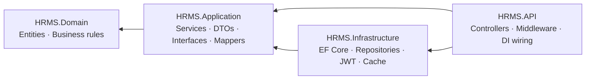

# HRMS API

A Human Resource Management System backend built on ASP.NET Core with Clean Architecture — employees, departments, designations, salary, payroll, roles and menu permissions, behind a JWT-secured, versioned REST API.

**Frontend:** [hrms-client](https://github.com/Fazlerabbi-Fahad/hrms-client) — Angular 21 SPA that consumes this API.

<!-- SCREENSHOT: replace with a Swagger UI screenshot showing the grouped endpoints -->
<!--  -->

---

## The problem this solves

HR data is relational, permission-sensitive, and it changes shape constantly — a new allowance field, a different payroll rule, a reorganised department tree. Most CRUD backends handle the first version of that fine and then rot, because the business rules end up tangled with the persistence code. Change how something is stored and you're editing the logic that decides who is allowed to see it.

This project is a deliberate attempt to avoid that: business rules live in a layer that does not know EF Core exists.

---

## Architecture

Four projects. One rule: **dependencies only point inward.**



| Project | Contains | Depends on |
|---|---|---|
| **HRMS.Domain** | Entities, `BaseEntity` audit fields, business rules | — |
| **HRMS.Application** | Use-case services, DTOs, mappers, and the *interfaces* for everything it needs (`IEmployeeRepository`, `ITokenService`, `ICacheService`, `IUnitOfWork`) | Domain |
| **HRMS.Infrastructure** | `HRMSDbContext`, EF Core Fluent API configurations, repository implementations, migrations, JWT token service, in-memory cache service, Unit of Work | Application, Domain |
| **HRMS.API** | Controllers, global exception middleware, auth/CORS/Swagger/Serilog setup | Application, Infrastructure |

The load-bearing detail: `HRMS.Application` declares `IEmployeeRepository`; `HRMS.Infrastructure` implements it. The service layer is written against the interface and never sees a `DbContext`. Swapping the persistence strategy is an Infrastructure change, not an Application rewrite.

---

## Features

**Domain coverage**

- Employees — CRUD, pagination, search, soft-delete with audit trail
- Departments, Designations, Employment Statuses, Payment Statuses
- Salary and Payroll records
- Roles and user-role assignment
- Menu / `UserWiseMenuInformation` — per-user navigation permissions

**API concerns**

- **JWT bearer authentication** with issuer, audience, lifetime and signing-key validation
- **BCrypt** password hashing
- **Role-based authorization** at the endpoint level — e.g. delete is `Admin` only, create/update is `Admin` or `HRAdmin`
- **API versioning** via `Asp.Versioning` — routes are `api/v{version}/[controller]`, default `1.0`
- **Consistent response envelope** — every endpoint returns `ApiResponse<T>` with `isSuccess`, `statusCode`, `data`, `message`, `errors`
- **Pagination** — `PagedResult<T>` with `items`, `totalCount`, `pageNumber`, `pageSize`
- **Global exception middleware** — maps exception types to status codes (`KeyNotFoundException` → 404, `UnauthorizedAccessException` → 401, `ArgumentException` → 400, `InvalidOperationException` → 409) so controllers stay free of try/catch
- **Unit of Work** with explicit transaction control for multi-repository writes
- **In-memory caching** on read paths via `ICacheService`, with structured cache keys
- **Serilog** structured logging to console, EF Core noise filtered out
- **Health check** at `/health`, backed by a `DbContext` connectivity probe
- **Security headers** — `X-Content-Type-Options`, `X-Frame-Options`, `X-XSS-Protection`
- **Swagger / OpenAPI** in development

---

## Tech stack

| Layer | Technology |
|---|---|
| Runtime | .NET 10 |
| Language | C# |
| Web | ASP.NET Core Web API |
| ORM | Entity Framework Core 10 (code-first, Fluent API configurations) |
| Database | Microsoft SQL Server |
| Auth | JWT Bearer · BCrypt.Net-Next |
| Logging | Serilog (console sink, machine-name enrichment) |
| Docs | Swashbuckle / Swagger UI |
| Versioning | Asp.Versioning.Mvc |

---

## Getting started

### Prerequisites

- [.NET 10 SDK](https://dotnet.microsoft.com/download)
- SQL Server (LocalDB, Express, or full)
- `dotnet-ef` tools — `dotnet tool install --global dotnet-ef`

### 1. Clone

```bash
git clone https://github.com/Fazlerabbi-Fahad/hrms-api.git
cd hrms-api
```

### 2. Configure secrets

`appsettings.json` ships with `SET_VIA_ENVIRONMENT` placeholders, and **the application will refuse to start until you override them** — no connection strings or signing keys are committed to this repo.

Use user-secrets for local development:

```bash
cd HRMS.API
dotnet user-secrets set "ConnectionStrings:DefaultConnection" "Server=localhost;Database=HRMSDb;Trusted_Connection=True;TrustServerCertificate=True;"
dotnet user-secrets set "JwtSettings:SecretKey" "a-long-random-secret-at-least-32-characters"
```

Or environment variables:

```bash
export ConnectionStrings__DefaultConnection="Server=localhost;Database=HRMSDb;Trusted_Connection=True;TrustServerCertificate=True;"
export JwtSettings__SecretKey="a-long-random-secret-at-least-32-characters"
```

The remaining JWT settings (`Issuer`, `Audience`, `ExpiryInMinutes`) are already in `appsettings.json` and can stay as they are.

### 3. Create the database

```bash
dotnet ef database update --project HRMS.Infrastructure --startup-project HRMS.API
```

### 4. Run

```bash
dotnet run --project HRMS.API
```

Swagger UI is then at `https://localhost:<port>/swagger`, and the health check at `/health`.

CORS is preconfigured for `http://localhost:4200`, which is where [hrms-client](https://github.com/Fazlerabbi-Fahad/hrms-client) runs.

---

## API overview

All routes are versioned: `api/v1/{controller}`.

| Controller | Purpose | Auth |
|---|---|---|
| `Auth` | `POST login`, `POST register` | Anonymous |
| `Employee` | List (paged + search), get by id, create, update, delete | JWT; write ops `Admin` / `HRAdmin` |
| `Department` | CRUD | JWT |
| `Designation` | CRUD | JWT |
| `EmploymentStatus` | CRUD | JWT |
| `PaymentStatus` | CRUD | JWT |
| `Salary` | CRUD | JWT |
| `Payroll` | CRUD, payroll records | JWT |
| `Role` | CRUD, role assignment | JWT |
| `Menu` | Per-user menu permissions | JWT |

### Response shape

Every endpoint returns the same envelope, so the client has one parsing path:

```json
{
  "isSuccess": true,
  "statusCode": 200,
  "data": {
    "items": [ ... ],
    "totalCount": 142,
    "pageNumber": 1,
    "pageSize": 20
  },
  "message": "Success",
  "errors": null
}
```

Failures use the same shape with `isSuccess: false` and a populated `errors` array.

---

## Project structure

```
HRMS.slnx
├── HRMS.Domain/
│   └── Entities/              BaseEntity, Employee, Department, Designation,
│                              Salary, Payroll, Role, User, UserRole, Menu, …
├── HRMS.Application/
│   ├── DTOs/                  Request/response DTOs, grouped by feature
│   │   └── Common/            ApiResponse<T>, PagedResult<T>, QueryParameters,
│   │                          CacheKeys, JwtSettings
│   ├── Interfaces/            IEmployeeService, IAuthService, ITokenService,
│   │   └── Repository/        ICacheService, IUnitOfWork, I*Repository
│   ├── Services/              Use-case implementations
│   ├── Mappers/               Entity ↔ DTO mapping
│   ├── Constants/             Role names, message constants
│   └── DependencyInjection.cs AddApplicationServices()
├── HRMS.Infrastructure/
│   ├── Data/
│   │   ├── HRMSDbContext/
│   │   └── Configurations/    EF Core Fluent API, one per entity
│   ├── Repositories/          Repository implementations
│   ├── Services/              TokenService (JWT), CacheService (IMemoryCache)
│   ├── Migrations/
│   ├── UnitOfWork.cs
│   └── DependencyInjection.cs AddInfrastructureServices()
└── HRMS.API/
    ├── Controllers/           BaseController + 10 feature controllers
    ├── Middleware/            GlobalExceptionMiddleware
    └── Program.cs             DI, auth, CORS, Serilog, Swagger, versioning
```

---

## Design decisions worth calling out

**Repository + Unit of Work on top of EF Core.** `DbContext` is already both, so this is a real trade-off, not a free win. It's here because the Application layer needs an abstraction it owns, and because multi-entity writes (creating an employee plus their salary record plus their user account) benefit from one explicit transaction boundary rather than several implicit ones.

**Fluent API over data annotations.** Mapping configuration lives in `Infrastructure/Data/Configurations`, one file per entity. Domain entities stay plain C# classes with no persistence attributes on them — which is the point of keeping Domain dependency-free.

**Exception-to-status-code mapping in middleware.** Services throw domain-meaningful exceptions; the middleware translates. Controllers stay thin and there is exactly one place that decides what a 404 looks like.

**Audit fields on `BaseEntity`.** `IsActive`, `CreatedBy`, `CreatedAt`, `UpdatedBy`, `UpdatedAt` on every entity, with deletes handled as soft deletes — HR records generally need to be recoverable and attributable.

---

## Roadmap

- [ ] Unit and integration test suites (xUnit + `WebApplicationFactory`)
- [ ] Docker Compose for API + SQL Server
- [ ] Re-enable list-level response caching with proper invalidation on write
- [ ] Refresh tokens
- [ ] FluentValidation for request DTOs
- [ ] CI pipeline (build + test on push)

---

## License

MIT
